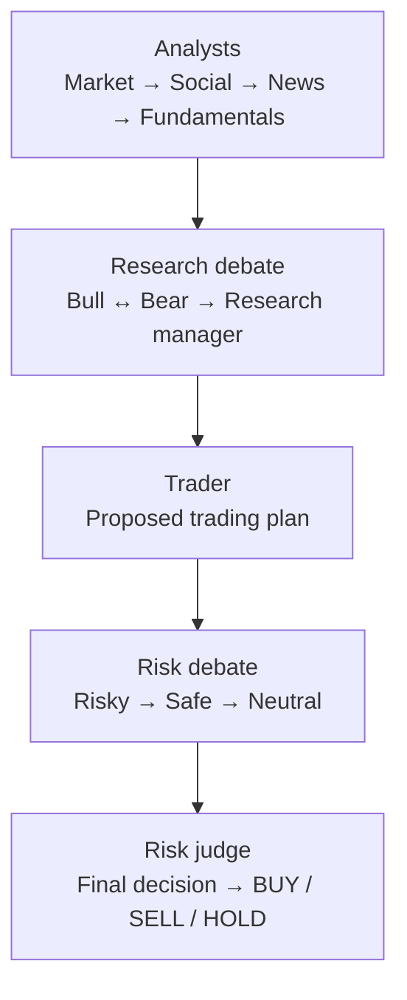

<p align="center">
  
</p>

<h1 align="center">TradingAgents (fork)</h1>

<p align="center"><b>Yanqing-Jiang's fork of <a href="https://github.com/TauricResearch/TradingAgents">TauricResearch/TradingAgents</a>.</b><br>
TradingAgents is a multi-agent LLM trading-research framework created by Tauric Research.<br>
LLM agents play analysts, bull and bear researchers, a trader and a risk team, then debate their way to a BUY, SELL or HOLD call.</p>

<p align="center">
<a href="https://yanqing.app/project/agentic-trade-bot/"><b>Yanqing’s related trading case study</b></a> ·
<a href="https://github.com/TauricResearch/TradingAgents"><b>Upstream project</b></a> ·
<a href="https://arxiv.org/abs/2412.20138"><b>Paper (arXiv 2412.20138)</b></a> ·
<a href="#run-the-cli">Run the CLI</a> ·
<a href="#use-it-from-python">Python usage</a> ·
<a href="#citation">Citation</a>
</p>

<p align="center">
  <a href="https://arxiv.org/abs/2412.20138"></a>
  <a href="https://discord.com/invite/hk9PGKShPK"></a>
  <a href="assets/wechat.png"></a>
  <a href="https://x.com/TauricResearch"></a>
  <a href="https://github.com/TauricResearch/"></a>
</p>

---

## About this fork

This repository is based on upstream commit `13b826a` (2025-10-09), with a separately maintained README. **This README describes the code in this fork, not current upstream.** For the latest features and documentation, use [TauricResearch/TradingAgents](https://github.com/TauricResearch/TradingAgents).

For Yanqing’s separate trading project, read the [Agentic Trading Bot case study](https://yanqing.app/project/agentic-trade-bot/). That portfolio project includes IBKR execution and is distinct from this upstream research-framework fork.

All framework design, code, paper and assets are the work of Tauric Research and the upstream contributors (paper authors: Yijia Xiao, Edward Sun, Di Luo, Wei Wang). The upstream demo video is on [YouTube](https://www.youtube.com/watch?v=90gr5lwjIho).

> TradingAgents is designed for research. Trading performance varies with the backbone models, temperature, trading period, data quality and other non-deterministic factors. [It is not intended as financial, investment, or trading advice.](https://tauric.ai/disclaimer/)

## How a run works

TradingAgents mirrors the roles of a trading firm. For one ticker and one date, [`tradingagents/graph/setup.py`](tradingagents/graph/setup.py) builds this LangGraph workflow:



The analysts run one after another in `selected_analysts` order (all four by default). The bull and bear researchers alternate for `max_debate_rounds`. The risky, safe and neutral debaters take turns for `max_risk_discuss_rounds` before the judge rules.

| Team | Agents in this code | Role |
|---|---|---|
| Analysts | `market`, `social`, `news`, `fundamentals` ([`agents/analysts/`](tradingagents/agents/analysts)) | Market data and technical indicators (such as MACD and RSI), company sentiment (in this version the social analyst reads through the same `get_news` tool), news and macro, company financials |
| Researchers | Bull and bear researchers plus a research manager ([`agents/researchers/`](tradingagents/agents/researchers), [`agents/managers/`](tradingagents/agents/managers)) | Debate the analyst reports and weigh upside against risk |
| Trader | [`agents/trader/`](tradingagents/agents/trader) | Turns the research into a trading plan |
| Risk | Risky, safe and neutral debaters plus a risk judge ([`agents/risk_mgmt/`](tradingagents/agents/risk_mgmt)) | Stress-test the plan. The judge writes the final trade decision |

The upstream paper and diagrams call the last step the Portfolio Manager and describe orders going to a simulated exchange. In this fork's code, the run ends at the Risk Judge. `propagate()` returns the final state plus a BUY, SELL or HOLD signal extracted by an LLM ([`graph/signal_processing.py`](tradingagents/graph/signal_processing.py)). There is no order-execution module.

<p align="center">
  
</p>

<details>
<summary>Upstream role diagrams</summary>
<p align="center">
  <br>
  <br>
  <br>
  
</p>
</details>

## Install

Python 3.10+ is required ([`pyproject.toml`](pyproject.toml); [`.python-version`](.python-version) pins 3.10). Upstream's instructions at this commit used conda with Python 3.13.

```bash
git clone https://github.com/Yanqing-Jiang/TradingAgents.git
cd TradingAgents
python -m venv .venv && source .venv/bin/activate
pip install -r requirements.txt
```

The default configuration needs two keys:

```bash
cp .env.example .env     # then fill in OPENAI_API_KEY and ALPHA_VANTAGE_API_KEY
```

| Key | Why |
|---|---|
| `OPENAI_API_KEY` | Default `llm_provider` is `openai`, and memory embeddings use `text-embedding-3-small` |
| `ALPHA_VANTAGE_API_KEY` | Default vendor for fundamentals and news. [`alpha_vantage_common.py`](tradingagents/dataflows/alpha_vantage_common.py) raises an error if it is unset. Free key: [alphavantage.co](https://www.alphavantage.co/support/#api-key) |

## Run the CLI

```bash
python -m cli.main
```

The CLI asks for a ticker, an analysis date, which analysts to run, a research depth (Shallow, Medium or Deep, which sets 1, 3 or 5 debate rounds), an LLM provider (OpenAI, Anthropic, Google, OpenRouter or Ollama), and a quick-thinking and a deep-thinking model. It then streams agent progress and reports live.

<p align="center">
  
</p>

<details>
<summary>More CLI screenshots</summary>
<p align="center">
  <br>
  <br>
  
</p>
</details>

Outputs land under `results/<TICKER>/<DATE>/`, with `reports/` and `message_tool.log`. Set `TRADINGAGENTS_RESULTS_DIR` to change the location. Every run also writes the full graph state to `eval_results/<TICKER>/TradingAgentsStrategy_logs/full_states_log_<DATE>.json`.

## Use it from Python

[`main.py`](main.py) is the runnable example:

```python
from tradingagents.graph.trading_graph import TradingAgentsGraph
from tradingagents.default_config import DEFAULT_CONFIG
from dotenv import load_dotenv

load_dotenv()
config = DEFAULT_CONFIG.copy()
config["deep_think_llm"] = "gpt-4o-mini"
config["quick_think_llm"] = "gpt-4o-mini"
config["max_debate_rounds"] = 1

ta = TradingAgentsGraph(debug=True, config=config)
final_state, decision = ta.propagate("NVDA", "2024-05-10")
print(decision)   # BUY, SELL or HOLD

# After you know the outcome, let the agents learn from it:
# ta.reflect_and_remember(1000)   # position returns
```

`TradingAgentsGraph(selected_analysts=[...])` takes any subset of `["market", "social", "news", "fundamentals"]`. The main settings in [`tradingagents/default_config.py`](tradingagents/default_config.py):

| Key | Default | Notes |
|---|---|---|
| `llm_provider` | `openai` | Also `anthropic`, `google`, `ollama`, `openrouter` |
| `deep_think_llm` / `quick_think_llm` | `o4-mini` / `gpt-4o-mini` | Upstream's paper experiments used `o1-preview` and `gpt-4o`. The framework makes many API calls, so choose cheaper models for testing |
| `backend_url` | `https://api.openai.com/v1` | Base URL for the chosen provider |
| `max_debate_rounds`, `max_risk_discuss_rounds` | `1`, `1` | Research and risk debate length |
| `data_vendors` | yfinance for prices and indicators, Alpha Vantage for fundamentals and news | Per category: `yfinance`, `alpha_vantage`, `openai`, `google`, `local` (options vary by category) |
| `tool_vendors` | empty | Per-tool override of `data_vendors`, e.g. `{"get_news": "openai"}` |

### Known limitations in this snapshot

- **`data_dir` is hard-coded** to an upstream developer's absolute path. Only the `local` vendor reads it. That vendor expects Tauric TradingDB, which upstream described as still in development and unreleased at this commit. The local vendor needs separately supplied datasets and adaptation of its hard-coded and import-time data paths.
- **Memory embeddings use the OpenAI client** against `backend_url`: `text-embedding-3-small`, or `nomic-embed-text` when `backend_url` is the local Ollama URL. With the `anthropic` or `google` providers, embedding calls may fail unless you adapt [`agents/utils/memory.py`](tradingagents/agents/utils/memory.py).
- The `openai` data vendor calls the OpenAI Responses API with `quick_think_llm`.
- [`test.py`](test.py) is a manual timing script for the yfinance indicator tools, not a test suite.

## Contributing

For upstream development and contribution information, visit [TauricResearch/TradingAgents](https://github.com/TauricResearch/TradingAgents), and see the [Tauric Research](https://tauric.ai/) community if you are interested in this line of research.

## Citation

If you use TradingAgents, cite the upstream authors:

```bibtex
@misc{xiao2025tradingagentsmultiagentsllmfinancial,
      title={TradingAgents: Multi-Agents LLM Financial Trading Framework},
      author={Yijia Xiao and Edward Sun and Di Luo and Wei Wang},
      year={2025},
      eprint={2412.20138},
      archivePrefix={arXiv},
      primaryClass={q-fin.TR},
      url={https://arxiv.org/abs/2412.20138},
}
```

## License

Apache License 2.0, inherited from upstream. See [`LICENSE`](LICENSE).
